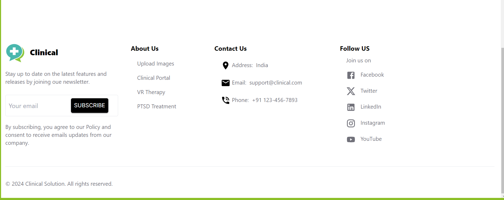

# Clinical App for PTSD Treatment

## Overview

This clinical app is a comprehensive and essential tool for clinicians in the healthcare sector, initially focusing on treating patients with PTSD with planned future expansion into other areas of mental health. Its primary purpose is to facilitate the creation, customization, and management of immersive 3D environments used in VR therapy. By providing a streamlined, user-friendly experience, the website equips clinicians with the necessary tools to offer personalized and effective treatment experiences, enhancing their therapeutic practices through cutting-edge virtual reality technology.

## Features

### Landing Page/Welcome Screen
- **Introduction**: Briefly explains the purpose and benefits of the app.
- **Navigation**: Easy-to-use navigation to help users find their way around the site.
- **Contact Information**: Provides users with ways to reach out for support or inquiries.

### Registration/Login
- **Secure Login**: Ensures user data is protected with secure authentication methods.
- **User Registration**: Allows new users to sign up and create an account.

### Upload Images
- **File Upload**: Users can upload images to be used in the creation of 3D environments for VR therapy.

## Screenshots


### Home Page


### Registration Page


### Login Page


### Upload Image Page


### Contact Page


## Getting Started

### Prerequisites
- [Node.js](https://nodejs.org/) installed on your machine.
- [npm](https://www.npmjs.com/) or [yarn](https://yarnpkg.com/) for package management.

### Installation

1. Clone the repository:
    ```sh
    git clone https://github.com/prititi/Clinical_fe.git
    cd clinical-fe
    ```

2. Install dependencies:
    ```sh
    npm install
    ```
    or
    ```sh
    yarn install
    ```

3. Start the development server:
    ```sh
    npm run dev
    ```

### Deployment

For deployment instructions, please refer to the `Deployment` section in the documentation.


## License

This project is licensed under the MIT License - see the [LICENSE.md](LICENSE.md) file for details.

## Contact

For any questions or suggestions, please contact us at support@clinicalapp.com.

---

Thank you for using our clinical app to enhance your therapeutic practices through innovative VR technology. We are committed to helping clinicians provide the best care for their patients.
